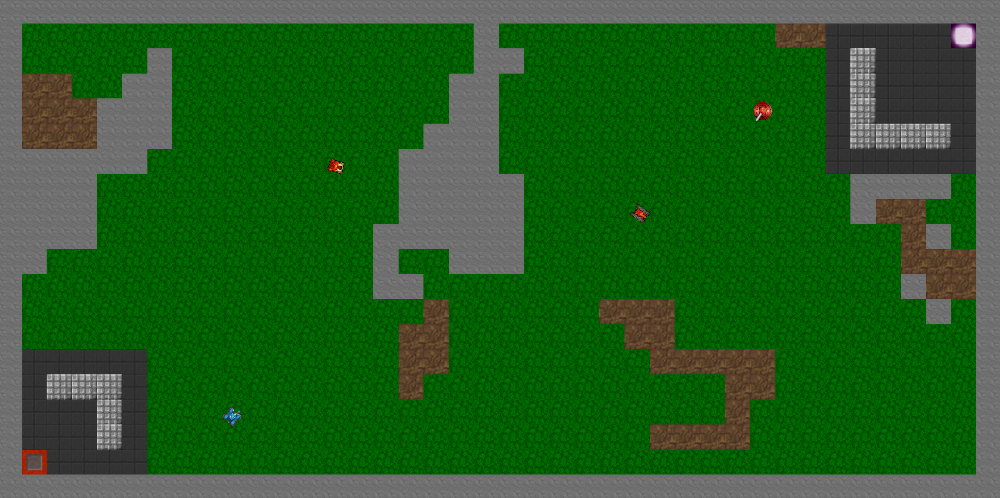
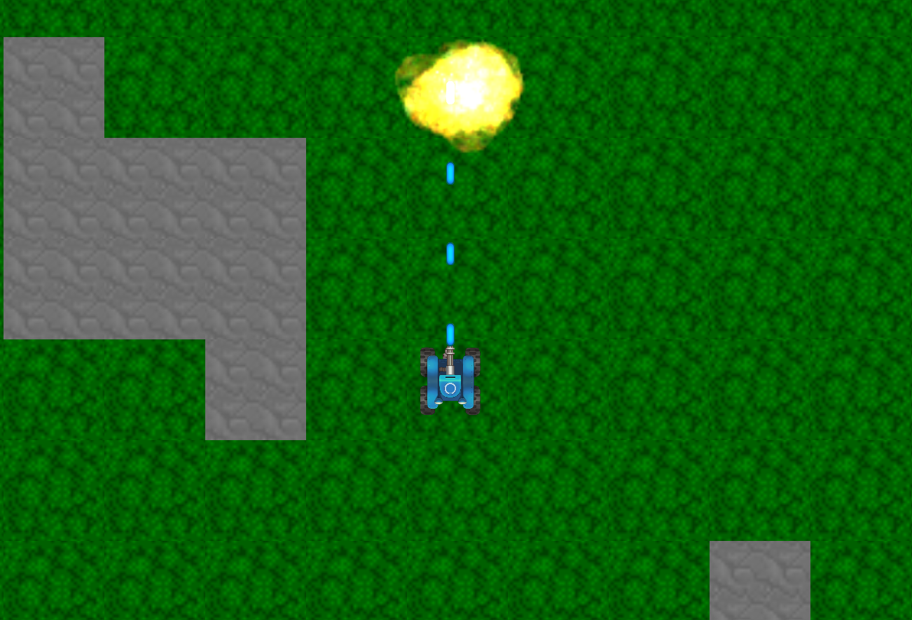

# LIBRA

A 2D top-down tank game where you traverse multiple randomly generated maps.

---

# Controls
## Keyboard
### Attract Controls
P	= Start Game \
ESC	= Exit Application

### In-Game Controls
W	 = Move Up \
A	= Move Left \
S	= Move Down \
D	= Move Right \
I = Aim Up \
J = Aim Left \
K = Aim Down \
L = Aim Right \
Space	= Shoot \
N	= Respawn \
P	= Pause \
ESC	= Return to Start Screen / Quit

## Controller
### Attract Controls
Start	= Start Game \
B	= Exit Application

### In-Game Controls
Left Thumbstick	= Move / Turn \
Right Thumbstick	= Aim \
A	= Shoot \
B	= Respawn \
Start	= Pause \
Debug Controls \
P	= Pause \
T	= Slow Motion \
Y = Speed Up \
O	= Step Frame \
F1	= Toggle Debug View \
F2 = Toggle Invulnerability \
F3 = Toggle No Clip \
F4 = Toggle Debug Map View \
F5 = Toggle Heat Map View \
F8	= Reset Game

# Features
3 Randomly Generated Maps \
Multiple Enemy Types \
Leo \
Aries \
Scorpio \
Keyboard and Controller Support \
Debug Tools for Development

Good luck, soldier. 🫡

